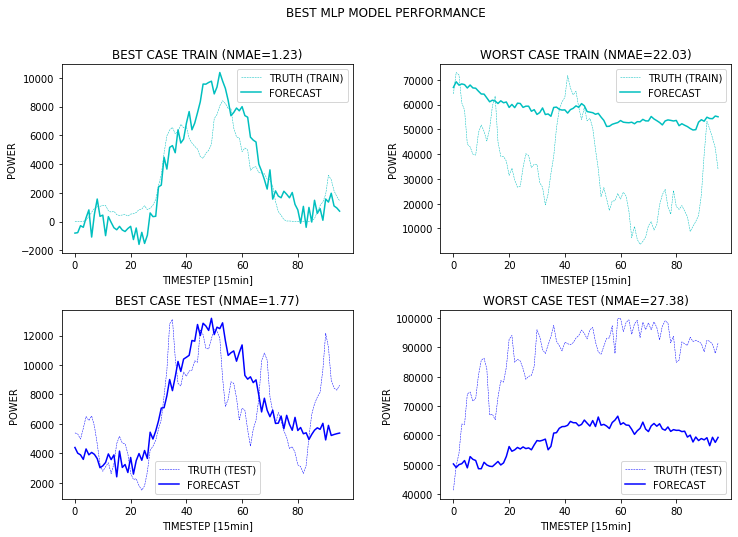
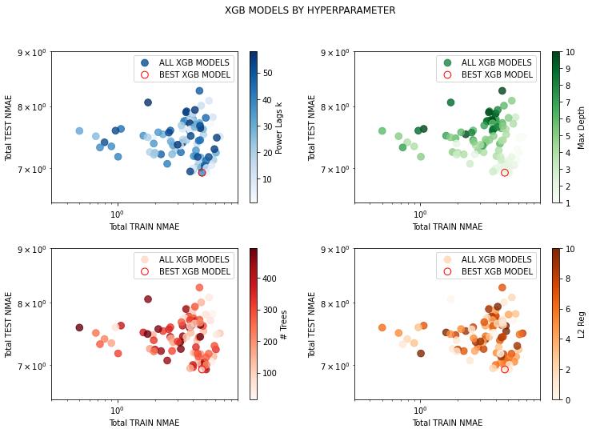

# windforecasting
Case study of time-series regression task for 24h wind forecasting that I did for an interview. Check the [notebook on kaggle](https://www.kaggle.com/christianmolliere/case-study-of-wind-forecasting) for the full results.

  
  Best & worst training and test cases (MLP)

## Contents of the Notebook
The notebook is comparted into three chapters.
1. Data Exploration
  - Outlier Detection
  - Augmented Dickey-Fulley (ADF) for stationarity
  - Normalization
2. Model Types & Hyperparamter Optimization
  - Ordinary Least Square (OLS) Regression
  - Extreme Gradient Boosting (XGB)
  - Multi-Layer Perceptron (MLP)
3. Summary & Discussion

## Hyperparameter Optimization
Random search is used to sample the high dimensional hyperparameter space of the models. In succession Bayesian Optimization might be a good option to further tune the models, despite the costly exploration. A example of the hyperparameter's influence on the XGB model performance can be seen below.

  
  Hyperparameter influence on XGB model performance

In this example it seems like XGB tree ensembles perform better when shallow and weakly regularised on the given dataset. Further details and discussion can be obtained from the notebook itself.

## How to use
Just clone the [notebook on kaggle](https://www.kaggle.com/christianmolliere/case-study-of-wind-forecasting) or run it on a local Jupyter Notebook server.
